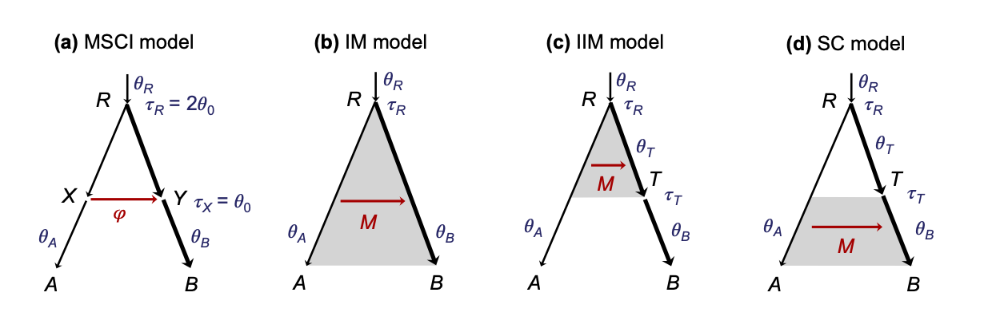

# iimmsci2s



A C program to calculate asymptotic maximum likelihood estimates (or pseudo-true parameter values) of parameters under the MSCI (multispecies coalescent [MSC] with introgression) model (a) of two species given that the true model is MSCM (MSC with migration; b-d), or vice versa, by minimizing the KL divergence.  Assume one sequence per species, an infinite number of loci, and a Poisson model of mutations.  Sequence length can be finite (n) or infinite.

Adapted from a program IMMSci2s written by [Ziheng Yang](http://abacus.gene.ucl.ac.uk/) for [Jiao et al, 2020](https://doi.org/10.1093/sysbio/syaa001), using routines from PAML ([Yang, 2007](https://doi.org/10.1093/molbev/msm088)).

This program was used in [Huang et al. (2022)](https://doi.org/10.1093/molbev/msac237) and Thawornwattana et al (2024).

References:

* [Huang et al. (2022)](https://doi.org/10.1093/molbev/msac237) Inference of gene flow between species under misspecified models. Mol. Biol. Evol., 39(12):msac237


## Install

```
git clone https://github.com/ythaworn/iimmsci2s.git
cd iimmsci2s
make
```

This should compile a program called `iimmsci2`.  Example scripts are in `script/`.
